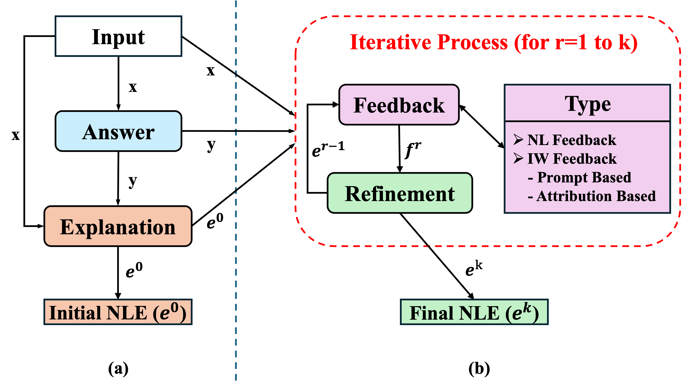

# Self-Refinement with Natural Language Explanation (SR-NLE)

[](https://arxiv.org/abs/2505.22823)

**[Yingming Wang](https://ymwangv.github.io), [Pepa Atanasova](https://apepa.github.io/)**

*The Conference on Empirical Methods in Natural Language Processing (EMNLP 2025)*

## Abstract

With the rapid development of large language models (LLMs), natural language explanations (NLEs) have become increasingly important for understanding model predictions. However, these explanations often fail to faithfully represent the model's actual reasoning process. While existing work has demonstrated that LLMs can self-critique and refine their initial outputs for various tasks, this capability remains unexplored for improving explanation faithfulness. To address this gap, we introduce Self-critique and Refinement for Natural Language Explanations (SR-NLE), a framework that enables models to improve the faithfulness of their own explanations -- specifically, post-hoc NLEs -- through an iterative critique and refinement process without external supervision. Our framework leverages different feedback mechanisms to guide the refinement process, including natural language self-feedback and, notably, a novel feedback approach based on feature attribution that highlights important input words. Our experiments across three datasets and four state-of-the-art LLMs demonstrate that SR-NLE significantly reduces unfaithfulness rates, with our best method achieving an average unfaithfulness rate of 36.02\%, compared to 54.81\% for baseline -- an absolute reduction of 18.79\%. These findings reveal that the investigated LLMs can indeed refine their explanations to better reflect their actual reasoning process, requiring only appropriate guidance through feedback without additional training or fine-tuning.



## Structure

```
SR-NLE/
├── configs/
├── src/
│   ├── attribution/
│   ├── data_format/
│   ├── data_gen/
│   ├── evaluation/
│   ├── model/
│   ├── runners/
│   ├── modules/
│   ├── prompts/
```

## Data Preparation

Raw datasets should be placed in `data/raw/`.

### Format Datasets
```bash
python src/data_format/format_dataset.py
```
Formats raw datasets into a unified structure in `data/formatted/`.

### Generate Edits
```bash
python src/data_gen/generate_edits.py
```
Generate edits in `data/counterfactual/`.

## Pipeline

The experiment pipeline consists of four steps that run iteratively:

### Step 1: Answer Generation
```bash
python src/runners/answer_runner.py \
    --config configs/answer.yaml \
    dataset.type=counterfactual \
    prompt.type=zs \
    dataset.name=comve \
    model.name=falcon \
    decoding.type=gd \
```

### Step 2: Explanation Generation
```bash
python src/runners/explanation_runner.py \
    --config configs/explanation.yaml \
    dataset.type=counterfactual \
    prompt.type=zs \
    dataset.name=comve \
    model.name=falcon \
    decoding.type=gd \
```

### Step 3: Feedback Generation
```bash
python src/runners/feedback_runner.py \
    --config configs/feedback.yaml \
    dataset.type=counterfactual \
    prompt.type=zs \
    dataset.name=comve \
    model.name=falcon \
    feedback.type=nl \
    iteration=0
```

### Step 4: Refinement Generation
```bash
python src/runners/refinement_runner.py \
    --config configs/refinement.yaml \
    dataset.type=counterfactual \
    prompt.type=zs \
    dataset.name=comve \
    model.name=falcon \
    feedback.type=nl \
    iteration=0
```

**Note**: Steps 3-4 repeat for multiple iterations (iter0, iter1, iter2) to iteratively improve explanations.

## Evaluation

```bash
# Evaluate counter rate
python src/evaluation/counter.py
```

```bash
# Evaluate faithfulness
python src/evaluation/faithfulness.py
```

## Citation

If you find this work is helpful to your research, please consider citing our paper:

```bibtex
@article{wang2025self,
  title={Self-Critique and Refinement for Faithful Natural Language Explanations},
  author={Wang, Yingming and Atanasova, Pepa},
  journal={arXiv preprint arXiv:2505.22823},
  year={2025}
}
```